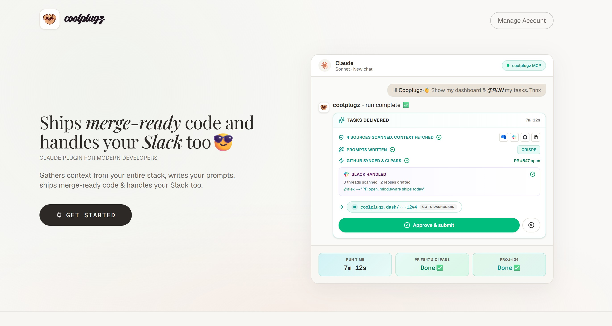
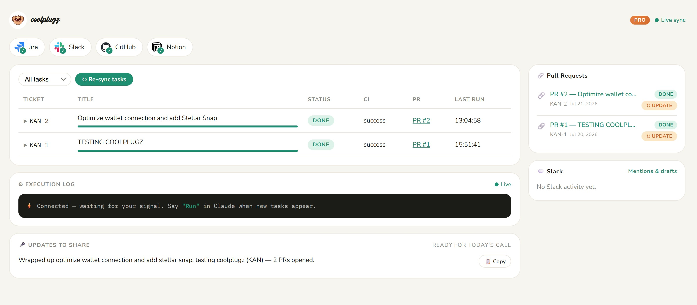
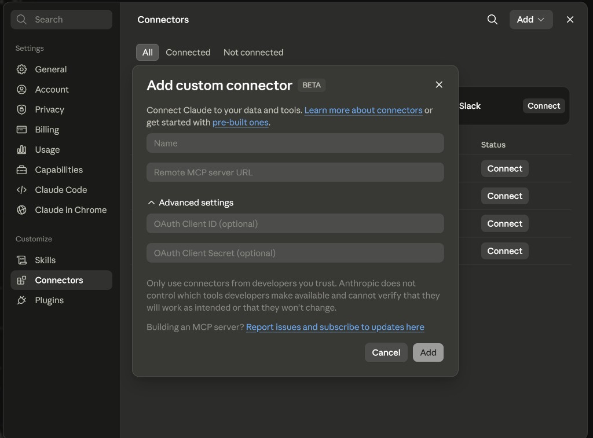
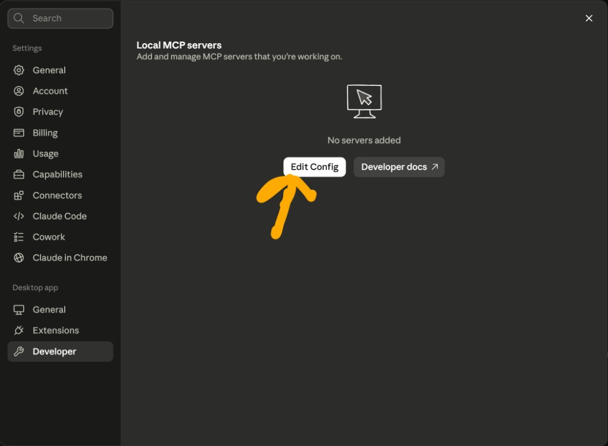

# CoolPlugz

**Ship merge-ready code and handle your Slack — from inside Claude.**

CoolPlugz is an MCP (Model Context Protocol) server for engineers who are tired of tab-hopping, re-prompting, and babysitting AI. Stay in Claude. CoolPlugz gathers context from **Jira, Slack, GitHub, and Notion**, engineers the prompt, runs the task, and delivers PRs, CI fixes, and Slack drafts — so you work less, save mental energy, and avoid AI fatigue and context-switching spirals.

**Website:** [coolplugz.com](https://www.coolplugz.com)

<p align="center">
  
  <br />
  <em>Coolplugz - Ships merge-ready code and handles your Slack</em>
</p>

<p align="center">
  
  <br />
  <em>Live dashboard - tasks, PRs, execution log, and updates to share</em>
</p>

---

## What CoolPlugz is

CoolPlugz is **not** another chat wrapper. It is a **paid MCP connector** that:

1. Gives each customer a **unique MCP URL** (minted after purchase)
2. **Fetches live context** from your engineering tools
3. **Builds structured prompts** (CRISPE-style) so Claude gets trustworthy inputs
4. **Executes end-to-end** — code, PRs, CI, Slack replies — from a single conversation

You connect once in Claude (web or desktop). After that, plain-English commands replace hours of manual context gathering.

---

## Who it is for

- **Senior / staff engineers** shipping daily across Jira + GitHub + Slack
- **Remote devs** drowning in notifications and standup prep
- **Solopreneurs & contractors** who need merge-ready output without brain fry from constant context switching
- **Teams** evaluating MCP workflows before rolling out org-wide (Enterprise)

If you spend more time **feeding context to AI** than doing the work, CoolPlugz is built for you.

---

## The problem we solve

| Pain | CoolPlugz answer |
|------|------------------|
| AI fatigue — endless prompt → fix → re-prompt loops | One `@RUN` completes a full ticket hands-off |
| Context switching — Jira tab, Slack tab, GitHub tab | One dashboard, one MCP, one chat |
| AI spirals — model drifts without grounded context | Context fetched from your real tools before every run |
| Mental load — “what was I doing on PROJ-124?” | Live task board + execution log in Claude |
| Low-quality AI output | CRISPE prompt engineering baked in per task |

**Goal:** deliver high-quality code and updates **by working less** — not by typing more prompts.

---

## How it works (high level)

```
You (Claude)          CoolPlugz MCP              Your tools
    │                      │                        │
    │  "Show my dashboard" │── fetch ──────────────►│ Jira · GitHub · Slack · Notion
    │                      │◄── context ────────────│
    │◄── dashboard UI ─────│                        │
    │                      │                        │
    │  "Run"               │── sync + execute ─────►│ tickets → PRs → CI → Slack drafts
    │◄── results ──────────│                        │
```

### 1. Unique MCP URL per user

After checkout, each customer receives a **private MCP endpoint**, for example:

```
https://api.coolplugz.com/mcp/your-unique-key-here
```

- **Starter** — 24-hour access, 1 full task
- **Pro** — persistent URL for the billing period, 10 tasks/month included
- URLs are **not shared** — one key per account

### 2. Context fetching

When you say **“Show my dashboard”** or **“Run”**, CoolPlugz:

- Pulls open Jira tickets assigned to you
- Scans linked GitHub repos, open PRs, and CI status
- Reads Slack mentions and threads that need replies
- Optionally syncs Notion docs linked to projects

All of this lands in a **single dashboard view** inside the MCP response — no copy-paste between tools.

### 3. Prompt creation (CRISPE)

Before execution, CoolPlugz builds a **structured prompt** from fetched context:

- **Context** — ticket description, acceptance criteria, related PRs
- **Role** — senior engineer executing the ticket
- **Instructions** — implementation steps derived from ticket + repo state
- **Style** — your repo conventions, stack, and patterns
- **Parameters** — scope limits, files to touch, CI constraints
- **Examples** — similar merged PRs when available

You never write this prompt manually. CoolPlugz assembles it so Claude (or the execution layer) works from **ground truth**, not guesswork.

### 4. Task execution & delivery

On **“Run”**, CoolPlugz orchestrates:

- Code changes and branch/PR creation
- CI awareness and fix suggestions
- Slack draft replies for stakeholders
- Status updates ready to approve and send

You stay in Claude. Approve & submit when ready.

---

## Pricing

| Plan | Price | What you get |
|------|-------|----------------|
| **Starter** | $5 / task | 1 full task end-to-end, 24h MCP access — try CoolPlugz hands-off |
| **Pro** | $47 / mo | 10 task credits / month, persistent MCP URL, top-ups available |
| **Pro annual** | $397 / yr | Same as Pro, ~30% savings |
| **Enterprise** | Custom | Multi-seat, CI/CD rollout, SSO — [contact sales](https://www.coolplugz.com/pricing) |

### Credit top-ups (Pro & Starter customers)

| Pack | Price | Runs |
|------|-------|------|
| Small | $10 | 5 bonus runs |
| Large | $20 | 10 bonus runs |

Bonus runs **never expire**. Top-ups appear in Manage Account after your first purchase.

### Referral program

Developers can earn **15% revenue share** when friends subscribe — friends get **15% off**. Details on the homepage [Make money with CoolPlugz](https://www.coolplugz.com/#make-money) section.

---

## Usage & task credits

- Each **“Run”** that executes a full task counts as **one run**
- **Starter:** 1 included run, 24h window
- **Pro:** 10 included runs per billing period (resets monthly/annually)
- **Top-ups:** bonus balance used after included runs are consumed
- Runs are tracked in **Manage Account** on [coolplugz.com/app](https://www.coolplugz.com/app)

CoolPlugz enforces fair-use server budgets per run so quality stays high without runaway cost.

---

## MCP setup — connect CoolPlugz to Claude

After purchase, open your **install page** (linked from account email or `/premium/unique-mcp-url`). Copy your unique URL, then choose **web** or **desktop**.

### Option A — Claude web (easiest)

1. Go to [claude.ai](https://claude.ai) → **Settings → Connectors → Add → Custom connector**
2. Name it `coolplugz`
3. Paste your unique MCP URL → **Add**



### Option B — Claude Desktop (JSON config)

1. **Settings → Developer → Edit Config**
2. Open `claude_desktop_config.json`:
   - **macOS:** `~/Library/Application Support/Claude/claude_desktop_config.json`
   - **Windows:** `%APPDATA%\Claude\claude_desktop_config.json`
3. Paste this JSON (replace the URL with yours):

```json
{
  "mcpServers": {
    "coolplugz": {
      "url": "https://api.coolplugz.com/mcp/your-unique-key-here",
      "transport": "http"
    }
  }
}
```

4. Save, **quit Claude Desktop completely**, then reopen



> **Company email on Claude?** If your org blocks custom MCPs on a work Claude account, sign in with a personal Claude email, connect CoolPlugz there, then authorize Jira/GitHub/Slack with your work accounts when prompted.

---

## Connect your tools

Type in Claude:

```
Show my dashboard
```

CoolPlugz shows **Connect** buttons for **Jira, GitHub, Notion, and Slack**. Click each, authorize in the popup, close the tab. Done — one time per tool.

---

## Commands to use in Claude

Plain English — no ticket IDs required for most flows:

| Say this | What happens |
|----------|----------------|
| `Show my dashboard` | Syncs tools; shows tasks, PRs, Slack drafts |
| `Run` | Works your incomplete Jira tickets — PRs, CI, Slack |
| `What's blocking my tasks?` | Re-analyzes stuck or failing work |
| `Show task PROJ-42` | Deep dive on one ticket |
| `Reject PROJ-42 and redo it` | Re-run with your feedback |
| `Refresh Slack` | Latest mentions + draft replies |
| `Refetch and rerun` | Pull fresh context and execute again |

Works on **Claude web and desktop**. Connect once, stays connected.

---

## What the dashboard shows

From your MCP-connected Claude session (and the CoolPlugz dashboard UI):

- **All tasks** — Jira tickets with status, CI, linked PRs
- **Execution log** — live feed while a run is in progress
- **Updates to share** — standup-ready summary for calls
- **Pull requests** — open PRs with CI pass/fail
- **Slack** — mentions scanned, replies drafted

See the dashboard screenshot at the top of this README.

---

## Architecture (public overview)

| Piece | Role |
|-------|------|
| **coolplugz.com** (this repo) | Marketing, auth, Stripe billing, MCP URL provisioning, usage ledger |
| **CoolPlugz MCP server** | Context sync, prompt engineering, task execution, per-user keys |
| **Claude** | Your interface — you chat; CoolPlugz is the connector |
| **Jira · GitHub · Slack · Notion** | Source-of-truth context |

Each paying user gets a **unique MCP key**. The website provisions the key after payment; the MCP server enforces run limits and TTL.

---

## Marketing & content hub

Use this README as the **single source of truth** for external messaging. Align all copy with:

- **Tagline:** Ships merge-ready code and handles your Slack in minutes
- **Starter pitch:** Finish one real task hands-off — $5 to try
- **Pro pitch:** 10 tasks/month for engineers shipping every day
- **Emotional hooks:** less context switching, less AI fatigue, more mental energy
- **Proof points:** CRISPE prompts, live Jira/GitHub/Slack sync, approve & submit workflow

### Official links

| Channel | URL |
|---------|-----|
| Website | [coolplugz.com](https://www.coolplugz.com) |
| Pricing | [coolplugz.com/pricing](https://www.coolplugz.com/pricing) |
| Guides (SEO) | [coolplugz.com/guides](https://www.coolplugz.com/guides) |
| LinkedIn | [linkedin.com/company/coolplugz](https://www.linkedin.com/company/coolplugz/) |
| GitHub | [github.com/adaOctopus/claude-plugins-app](https://github.com/adaOctopus/claude-plugins-app) |
| X | [@CryptoSympozium](https://x.com/CryptoSympozium) |

### Screenshot assets (for posts & docs)

| File | Use |
|------|-----|
| `public/og-coolplugz.jpg` | **Social / OG thumbnail** — Twitter, LinkedIn, Slack link previews |
| `public/marketing/dashboard.jpg` | Live dashboard UI |
| `public/guides/claude-web-connector.png` | Web MCP setup |
| `public/guides/claude-desktop-edit-config.png` | Desktop JSON setup |

---

## Repository note

This repository is the **CoolPlugz marketing & billing website** (Next.js 15, App Router, TypeScript). The MCP execution server is a separate deployment. Operational runbooks and internal configuration are **not** published in this public README.

For SEO operations and partner promo internals, see `docs/seo-ops.md` and `docs/partner-promos.md` (no secrets — admin access required at runtime).

---

## License

© CoolPlugz Inc. All rights reserved.
